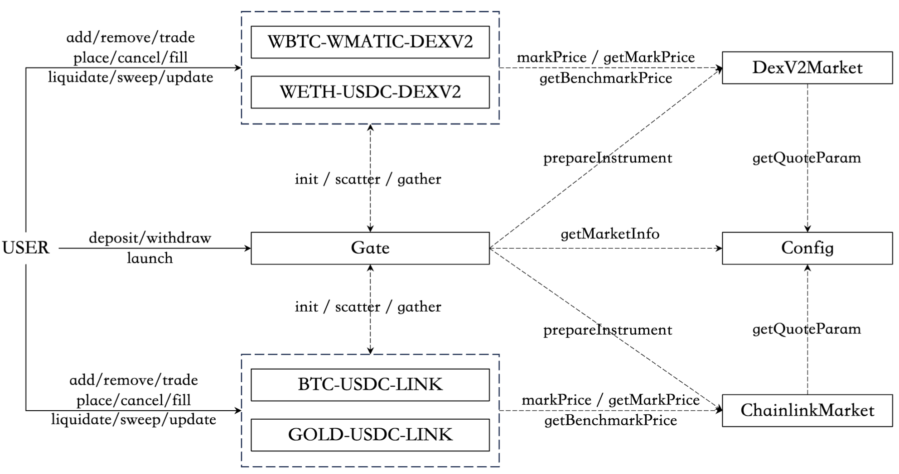

# Perp

- [Perp](#perp)
    - [Introduction](#introduction)
    - [Install](#install)
    - [Initialization example](#initialization-example)
    - [Examples](#examples)
        - [Get All Instruments](#get-all-instruments)
        - [Get Instrument By Symbol](#get-instrument-by-symbol)
        - [Get Instrument By Quote \& Base Symbol](#get-instrument-by-quote--base-symbol)
        - [Get Account Portfolio](#get-account-portfolio)
        - [Deposit to `Gate`](#deposit-to-gate)
        - [Withdraw from `Gate`](#withdraw-from-gate)
        - [Add Liquidity](#add-liquidity)
        - [Add asymmetric liquidity](#add-asymmetric-liquidity)
        - [Remove liquidity](#remove-liquidity)
        - [Place Market Order](#place-market-order)
        - [Adjust Position](#adjust-position)
        - [Close Position](#close-position)
        - [Place Limit order](#place-limit-order)
        - [Cancel limit order](#cancel-limit-order)
        - [Batch Scaled Limit Orders](#batch-scaled-limit-orders)
        - [Batch Cancel Limit Orders](#batch-cancel-limit-orders)
        - [Place Cross Market Order](#place-cross-market-order)

## Perp Contract Architecture

SynFutures@v3 delivers the first implementation of Oyster AMM for the derivatives market. Just like the previous two versions, the permissionless feature is maintained where anyone can easily launch a new derivatives trading pair within seconds as long as there is a proper price feed for the the underlying asset, e.g., Bitcoin, gold, etc. The new version also inherits the transparent feature from the previous versions, where all the actions take place on-chain, including the limit order related operations. A derivatives instrument is usually identified by the underlying asset (base and quote) as well as the expiry time. Yet, to support more diverse underlying assets and considering the current reality of the on-chain worlds where a one-stop price feed solution is not available, SynFutures@v3 introduces another dimension, the market type, and is architected in a way that it can easily support more diverse price feeders in the future. As of now, we support CHAINLINK, Pyth, Uniswap V2 style spot DEX as price feeders, where the corresponding pair are instantiated as market contract `ChainlinkMarket/PythMarket/DEXv2Market` and given the `LINK/PYTH/DEXV2` market type name, respectively. Hence, an instrument in SynFutures@v3 is identified as `BTC-USDC-LINK`, `USDB-WETH-PYTH`. While the base can be anything in SynFutures@v3, the quote is limited to ERC20 tokens only. Information on supported markets as well as parameters of supported quotes are managed by `Config` contract, refer to the following figure for the overall architecture of SynFutures@v3 perp.



SynFutures@v3 supports both perpetual and dated futures, and both types of futures are implemented within a single contract Instrument as they share most of the logic. To simplify the statement, we use perp and dated to refer to the perpetual futures and dated futures, respectively. A pair can refer to a perpetual or a dated futures. perp and dated shares the same interfaces and are distinguished only by the expiry time, where the former is identified by `type(uint32).max` to reflect the perpetual nature and the latter is identified by the actual expiry time, 8AM UTC on every Friday. Only dated futures with an expiry time within 13 weeks can be initialized. This particular time window is chosen so that both short term and quarterly futures can be supported, where the former comes in handy to follow the trend in the DeFi world and the latter is the one that usually matters most. With lessons learned from the previous versions and considering the innovations such as Abstract Account, SynFutures@v3 is designed to be more gas efficient, intuitive and flexible for future extensions. The common router pattern in spot DEX platforms is not adopted in SynFutures@v3 to save gas consumption. Rather, the user interacts directly with the interested pair of the interested `Instrument`.

To improve the user experience, SynFutures@v3 introduces `Gate` contract serving as the margin center to handle all margin transfers in/out or circulating within SynFutures@v3. With `Gate` contract, one ERC20 `approve()` per quote token is enough to provide a smooth experience thereafter. Although the user can explicitly `deposit()` margin into `Gate` contract, usually it is not needed. When interacting with `Instrument` to `trade()` or `place()` limit order, etc., the user just specifies how much margin to use, then `Instrument` will request the specified margin from `Gate`. The margin will be supplied to `Instrument` via `scatter()` if the user has enough reserve in Gate. Otherwise, `Gate` will try to transfer an appropriate margin from the user wallet to fulfill the request. That is, as long as there is enough reserve in `Gate` or quote token allowance for `Gate`, the deposit is handled implicitly. On the other hand, the margin released by user actions, e.g., close open position via `trade()` or `cancel()` limit order, is transferred back to `Gate` via `gather()` for future use. At anytime, the user can `withdraw()` margin explicitly from `Gate` to wallet. Besides margin management, `Gate` also helps to simplify the new instrument launch procedure. Creating new `Instrument` and initializing corresponding trading pair can be done in one transaction via the `launch()` method of `Gate`.

Besides the user experience improvement, `Gate` also helps to isolate risk. With the intrinsic risk in the derivatives market, risk isolation is vital in SynFutures@v3. The smart contract structure shown in above figure is designed to achieve this goal as well, where `Gate` and each `Instrument` are isolated from each other. Moreover, the risk isolation is also applied to the pairs within the same `Instrument`. A dedicated field is embedded into the core of each pair to track the amount of margin involved in this pair. All margin going out is explicitly checked against this tracker to make sure that this pair never overspends. Even better, this field introduces an invariant between the pairs and the `Instrument`: quote balance of Instrument address always equals the sum of involved funds of all pairs. In this way, the margin between different pairs is isolated, and the risk is contained at the pair level.

## Perp SDK Introduction

Perp includes the following modules:

- `contracts` The Instrument contract is our core contract, facilitating all order and liquidity-related interactions. This module primarily offers functionalities such as placing orders, modifying orders, canceling orders, providing liquidity, removing liquidity, and other related operations.
- `config` Provides some methods to read config contract.
- `observer` The Observer contract is our auxiliary contract, primarily responsible for encapsulating the Gate and Instrument contracts, enabling users to conveniently query protocol data. It mainly provides functionalities for retrieving detailed information about the Instrument and AMM, obtaining portfolio data, token information, and querying prices.
- `instrument` The Instrument contract is our core contract, facilitating all order and liquidity-related interactions. This module primarily offers functionalities such as placing orders, modifying orders, canceling orders, providing liquidity, removing liquidity, and other related operations.
- `simulate` The Simulate module is primarily used for performing simulations. Since interacting directly with the Instrument contract requires complex input parameters, the Simulate module simplifies the process of conducting pre-operation simulations. Users can double-check the simulation results, making order placement and liquidity operations more user-friendly and efficient.
- `calc` Provides some calculation methods, such as the calculation of sqrtX96 and so on.
- `configuration` Will load SynFutures configuration from local file, such as some contracts address for the corresponding network
- `gate` Provides some methods to interact with the Gate contract.

## Install

```sh
npm i @synfutures/sdks-perp
```

## Initialization example

```ts
import { Context } from '@derivation-tech/context';
import { perpPlugin, utils } from '@synfutures/sdks-perp';
import { txPlugin } from '@derivation-tech/tx-plugin';

const ctx = new Context('base', {
    url: process.env['BASE_RPC'],
})
    .use(perpPlugin())
    .use(txPlugin());
await ctx.init();
```

## Examples

### Get All Instruments

```ts
// Get All Instruments
// will return an array of all instruments
const allInstruments = await ctx.perp.observer.getAllInstruments();

for (const instrument of allInstruments) {
    console.log(`${instrument.symbol}: ${utils.formatInstrument(instrument)}`);
}
```

### Get Instrument By Symbol

```ts
// Get Instrument by instrument Symbol (e.g. BTC-USDC-LINK)
const instrument = await ctx.perp.observer.getInstrument('BTC-USDC-LINK');
// e.g
// "instrumentAddr": "0xec6c44e704eb1932ec5fe1e4aba58db6fee71460",
// "symbol": "BTC-USDC-LINK",
// "spotPrice": "68703.549887170450542478",
// "amms": {
//   "4294967295": {
//     "expiry": 4294967295,
//     "markPrice": "68703.549887170450542478",
//     "fairPrice": "68787.576227929199424705"
//   }
// }
console.log(utils.formatInstrument(instrument));
```

### Get Instrument By Quote & Base Symbol

```ts
const instruments = await ctx.perp.observer.getAllInstruments();

// Get all instruments with USDC as quote
const instrumentQuoteMap = utils.groupBy(instruments, (instrument) => instrument.quote.symbol);
const instrumentsUsdcQuote = instrumentQuoteMap.get('USDC');

// Get all instruments with BTC as base
const instrumentBaseMap = utils.groupBy(instruments, (instrument) => instrument.base.symbol);
const instrumentsBtcBase = instrumentBaseMap.get('BTC');
```

### Get Account Portfolio

```ts
const accAddr = process.env['ACCOUNT_ADDRESS'];

// Get the balance of the account in Gate
const balances = await ctx.perp.observer.getGateBalances(accAddr);
for (let i = 0; i < balances.length; i++) {
    console.log(
        `Token ${balances[i].symbol} balance: ${ethers.utils.formatUnits(balances[i].balance, balances[i].decimals)}`,
    );
}

// Get account Portfolio
const allInstruments = await ctx.perp.observer.getAllInstruments();
const params = allInstruments.flatMap((instrument) => {
    return Array.from(instrument.amms.keys()).map((expiry) => {
        return {
            traderAddr: accAddr,
            instrumentAddr: instrument.instrumentAddr,
            expiry,
        };
    });
});
const portfolios = await ctx.perp.observer.getPortfolio(params);

for (let i = 0; i < portfolios.length; i++) {
    const instrument = allInstruments.find((instrument) => instrument.instrumentAddr === portfolios[i].instrumentAddr);
    console.log(`Portfolio for ${instrument.symbol}: ${utils.formatPortfolio(portfolios[i], instrument)}`);
}
```

### Deposit to `Gate`

```ts
// get your own signer
import { ERC20__factory } from '@derivation-tech/contracts';
const signer = new ethers.Wallet(process.env['YOUR_PRIVATE_KEY'], ctx.provider);

// get USDC token info
const usdc = await ctx.getTokenInfo('USDC');

// approve
const erc20 = ERC20__factory.connect(usdc.address, signer);
await erc20.approve(ctx.perp.contracts.gate.address, ethers.constants.MaxUint256);

// deposit
await ctx.perp.gate.deposit(usdc.address, ethers.utils.parseUnits('10', usdc.decimals), {
    signer,
});

console.log('Deposit 10 USDC to gate');
```

### Withdraw from `Gate`

```ts
// get your own signer
const signer = new ethers.Wallet(process.env['YOUR_PRIVATE_KEY'], ctx.provider);

// 1. withdraw USDB
// get USDB token info
const usdc = await ctx.getTokenInfo('USDC');
await ctx.perp.gate.withdraw(usdc.address, ethers.utils.parseUnits('1', usdc.decimals), {
    signer,
});
console.log('Withdraw 1 USDC from the gate');

// 2. withdraw WETH
await ctx.perp.gate.withdraw(
    ctx.wrappedNative.address,
    ethers.utils.parseUnits('0.01', await ctx.wrappedNative.decimals()),
    {
        signer,
    },
);

// 3. withdraw all WETH to ETH
await ctx.perp.gate.withdraw(
    NATIVE_TOKEN_ADDRESS,
    await ctx.contracts.gate.reserveOf(ctx.wrappedNative.address, signer.address),
    {
        signer,
    },
);
```

### Add Liquidity

```ts
// Get your own signer
const signer = new ethers.Wallet(process.env['YOUR_PRIVATE_KEY'], ctx.provider);
const expiry = PERP_EXPIRY;
// Get instrument info, e.g. SUI-USDC-EMG
const instrument = await ctx.perp.observer.getInstrument('SUI-USDC-EMG');
const amm = instrument.amms.get(expiry);

// margin to add liquidity
const margin = ethers.utils.parseUnits('100', 18);
// alphaWad to add liquidity
// liquidity range factor, 1.5 means [1/1.5, 1.5]x current price
const alphaWad = ethers.utils.parseUnits('1.5', 18);
// slippage, 100 means 100 / 10000 = 1%
const slippage = 100;

// Get the simulated result
const simulateResult = await ctx.perp.simulate.simulateAddLiquidity({
    expiry,
    instrument,
    alphaWad,
    slippage,
    margin,
});

// simulated result e.g
// "Current Price": "1.868934966680585916",
// "Capital Efficiency Boost": 25.629272294097362,
// "Removal Price": "1.239848569410801495 ~ 2.814960567356706175",
// "Liquidation Price": "0.940030898283775598 ~ 2.880424766597559808",
// "minEffectiveQuoteAmount": "200.0",
// "minMargin": "7.954202905259311461"
console.log(utils.formatSimulateAddLiquidityResult(simulateResult, amm, instrument.setting.maintenanceMarginRatio));

// To meet the minimum effective liquidity: simulateResult.minEffectiveQuoteAmount
// the margin should be greater than simulateResult.minMargin, please check it

// Use the simulated result to add liquidity
await ctx.perp.instrument.addLiquidity(
    {
        instrumentAddr: instrument.instrumentAddr,
        expiry,
        tickDeltaLower: simulateResult.tickDelta,
        tickDeltaUpper: simulateResult.tickDelta,
        margin,
        limitTicks: simulateResult.limitTicks,
        deadline: Math.floor(Date.now() / 1000) + 300, // deadline, set to 5 minutes later
        referralCode: 'YOUR_REF_CODE_OR_UNDIFINED',
    },
    { signer },
);
```

### Add asymmetric liquidity

```ts
const expiry = PERP_EXPIRY;
// Get your own signer
const signer = new ethers.Wallet(process.env['YOUR_PRIVATE_KEY'], ctx.provider);
// Get instrument info, e.g. SUI-USDC-EMG
const instrument = await ctx.perp.observer.getInstrument('SUI-USDC-EMG');
const amm = instrument.amms.get(expiry)!;

// margin to add liquidity
const margin = ethers.utils.parseUnits('100', 18);
// alphaWad to add liquidity
// Add liquidity with asymmetric range, so we choose two alphaWad
const alphaWadLower = ethers.utils.parseUnits('1.8', 18);
const alphaWadUpper = ethers.utils.parseUnits('2.0', 18);
//slippage, 100 means 100 / 10000 = 1%
const slippage = 100;

// Get the simulated result
const simulateResult = await ctx.perp.simulate.simulateAddLiquidityWithAsymmetricRange({
    expiry,
    instrument,
    alphaWadLower,
    alphaWadUpper,
    slippage,
    margin,
});
//e,g
// "Current Price": "1.919121265723978277",
// "Capital Efficiency Boost": 12.303577359188738,
// "Removal Price": "1.061833361252848991 ~ 3.857165180617093694",
// "Liquidation Price": "0.13542114178514542 ~ 3.946866696445398199",
// "minEffectiveQuoteAmount": "200.0",
// "minMargin": "23.368586432310517677"
console.log(
    utils.formatSimulateAddLiquidityWithAsymmetricRangeResult(
        simulateResult,
        amm,
        instrument.setting.maintenanceMarginRatio,
    ),
);

// To meet the minimum effective liquidity: simulateResult.minEffectiveQuoteAmount
// the margin should be greater than simulateResult.minMargin, please check it
await ctx.perp.instrument.addLiquidity(
    {
        instrumentAddr: instrumentAddress,
        expiry,
        tickDeltaLower: simulateResult.tickDeltaLower,
        tickDeltaUpper: simulateResult.tickDeltaUpper,
        margin,
        limitTicks: simulateResult.limitTicks,
        deadline: Math.floor(Date.now() / 1000) + 300, // deadline, set to 5 minutes later
        referralCode: 'YOUR_REF_CODE_OR_UNDIFINED',
    },
    { signer },
);
```

### Remove liquidity

```ts
// Get your own signer
const signer = new ethers.Wallet(process.env['YOUR_PRIVATE_KEY'], ctx.provider);
// Get instrument info, e.g. SUI-USDC-EMG
const instrument = await ctx.perp.observer.getInstrument('SUI-USDC-EMG');
const amm = instrument.amms.get(expiry)!;
const portfolio = await ctx.perp.observer.getPortfolio({
    traderAddr: signer.address,
    instrumentAddr: instrument.instrumentAddr,
    expiry: PERP_EXPIRY,
});
// Get the first range of ranges map
const range = portfolio.ranges.values().next().value;
// Print the Range info
console.log(`Range: ${utils.formatRange(range, amm, instrument.setting.maintenanceMarginRatio)}`);

// Get the current position
const position = portfolio.position;
// If the position.size is 0, means no position
console.log(`Position now : ${utils.formatPosition(position, amm, instrument.setting.maintenanceMarginRatio)}`);

//slippage, 100 means 100 / 10000 = 1%
const slippage = 100;

// Simulate remove liquidity
// The removeLiquidity operation will generate a corresponding position,
// this is referred to as the `removedPosition`.
// The generated position `removedPosition` and the existing position are merged to produce a new position,
// which is called the `postPosition`.
const simulateResult = await ctx.perp.simulate.simulateRemoveLiquidity({
    tradeInfo: portfolio,
    tickLower: range.tickLower,
    tickUpper: range.tickUpper,
    slippage: slippage,
});
//e.g
// "Removed position": {
//   "side": "LONG",
//   "size": "0.684599964523390473",
//   "Avg.Price": "1.885390164171079776",
//   "Margin": "20.014250058525256806",
//   "Leverage": "0.065705032123893451",
//   "Liq.Price": "0.0",
//   "Mark Price": "1.920883744051242925"
// },
// "Post position": {
//   "side": "LONG",
//   "size": "0.684599964523390473",
//   "Avg.Price": "1.885390164171079776",
//   "Margin": "20.014250058525256806",
//   "Leverage": "0.065705032123893451",
//   "Liq.Price": "0.0",
//   "Mark Price": "1.920883744051242925"
// },
console.log(utils.formatSimulateRemoveLiquidityResult(simulateResult, amm, instrument.setting.maintenanceMarginRatio));
// Remove liquidity
await ctx.perp.instrument.removeLiquidity(
    {
        expiry: PERP_EXPIRY,
        traderAddr: signer.address,
        tickLower: range.tickLower,
        tickUpper: range.tickUpper,
        limitTicks: simulateResult.limitTicks,
        deadline: Math.floor(Date.now() / 1000) + 300, // deadline, set to 5 minutes later
        instrumentAddr: instrument.instrumentAddr,
    },
    {
        signer,
    },
);
```

### Place Market Order

```ts
// Get your own signer
const signer = new ethers.Wallet(process.env['YOUR_PRIVATE_KEY'], ctx.provider);
const expiry = PERP_EXPIRY;
// Get instrument info, e.g. SUI-USDC-EMG
const instrument = await ctx.perp.observer.getInstrument('SUI-USDC-EMG');
const amm = instrument.amms.get(expiry)!;

// Place Market Order means open a position by market price, can be placed by margin or leverage
// Place by margin
// TradeInfo
const tradeInfo = {
    instrumentAddr: instrument.instrumentAddr,
    expiry,
    traderAddr: signer.address,
};
// side: Side.SHORT or Side.LONG
const side = Side.LONG;
// size is the size of the position you want to open, can be quote or base
// Could be by quote or by base, by quote the amount is in quote token,
// must greater than the instrument.minTradeValue
// by base the amount is in base token
// the minimum amount is Could be caulculated
// minBaseInfo.baseAmount is the minimum base amount you can open a position
// const minBaseInfo = await ctx.perp.observer.inquireByQuote(
//     instrument.instrumentAddr,
//     expiry,
//     side,
//     instrument.minTradeValue,
// );

// slippage 100 means 1%
const slippage = 100;
const sizeByQuote = { quote: instrument.minTradeValue };
// Margin is the amount of margin you want to use to open a position
// must greater than min margin
// you can use ctx.perp.observer.inquireByQuote or ctx.perp.observer.inquireByBase
// to get the minimum margin
// for example, use inquireByQuote
// const result = await ctx.perp.observer.inquireByQuote(
//   instrumentAddress,
//   expiry,
//   side,
//   yourQuoteAmount
// );
// minMargin = result.quotation.minAmount
const margin = parseEther('100');

const resultByMargin = await ctx.perp.simulate.simulateMarketOrderByMargin({
    tradeInfo,
    side,
    size: sizeByQuote,
    slippage,
    margin,
});

// postPosition is the simulated position after the order is placed
// will merge with the current position if you already have a position
//e.g.
// "Price Impact": "0.7580007203653651%",
// "Est. Trade Value": "20.000000000000000001",
// "Trading Fee": "0.008000000000000001",
// "Margin": "100.0",
// "Leverage": "0.200000138973997928",
// "Post position": {
//     "side": "LONG",
//     "size": "10.376972616224775999",
//     "Avg.Price": "1.927344394137580062",
//     "Margin": "99.940098202946864446",
//     "Leverage": "0.199601087624083387",
//     "Liq.Price": "0.0",
//     "Mark Price": "1.922347975302183071"
//   }
console.log(utils.formatSimulateMarketOrderResult(resultByMargin, amm, instrument.setting.maintenanceMarginRatio));

await ctx.perp.instrument.placeMarketOrder(
    {
        instrumentAddr: instrument.instrumentAddr,
        expiry,
        side,
        baseSize: resultByMargin.size.base,
        margin: margin,
        limitTick: resultByMargin.limitTick,
        deadline: Math.floor(Date.now() / 1000) + 5 * 60, // 5 minutes
    },
    {
        signer,
    },
);

// Place by leverage
// Leverage is the leverage you want to use to open a position
// by Leverage will simulate the Margin
const resultByLeverage = await ctx.perp.simulate.simulateMarketOrderByLeverage({
    tradeInfo,
    side,
    size: sizeByQuote,
    slippage,
    leverage: parseEther('5'),
});
console.log(utils.formatSimulateMarketOrderResult(resultByLeverage, amm, instrument.setting.maintenanceMarginRatio));
await ctx.perp.instrument.placeMarketOrder(
    {
        instrumentAddr: instrument.instrumentAddr,
        expiry,
        side,
        baseSize: resultByLeverage.size.base,
        margin: resultByLeverage.margin,
        limitTick: resultByLeverage.limitTick,
        deadline: Math.floor(Date.now() / 1000) + 5 * 60, // 5 minutes
    },
    {
        signer,
    },
);
```

### Adjust Position

```ts
// Get your own signer
const signer = new ethers.Wallet(process.env['YOUR_PRIVATE_KEY'], ctx.provider);
const expiry = PERP_EXPIRY;
// Get instrument info, e.g. SUI-USDC-EMG
const instrument = await ctx.perp.observer.getInstrument('SUI-USDC-EMG');
const amm = instrument.amms.get(expiry)!;
// Get your existing position first
const portfolio = await ctx.perp.observer.getPortfolio({
    traderAddr: signer.address,
    expiry,
    instrumentAddr: instrument.instrumentAddr,
});
// If position.size is 0 means no position
const position = portfolio.position;
if (position.size.eq(ZERO)) {
    console.log('No position found');
    return;
}
// Print your position info
console.log('Position info', utils.formatPosition(position, amm, instrument.setting.maintenanceMarginRatio));

// slippage, 100 means 1%
const slippage = 100;
// Ajdust position can by two ways, by margin or by leverage
// Adjust position by adusting margin amount
// For example ,now we want to add 100 quote asset to the position
// Simulate the result first
const resultByMargin = await ctx.perp.simulate.simulateAdjustMarginByMargin({
    tradeInfo: position,
    slippage,
    transferIn: true, // transfer into the position or out of the position
    margin: parseEther('100'), // margin to transfer in/out
});
//e.g
// "Leverage": "0.000503582363205094",
// "Post position": {
//     "side": "SHORT",
//     "size": "-0.03122613607861294",
//     "Avg.Price": "1.920081018288159",
//     "Margin": "120.001175942508073937",
//     "Leverage": "0.000503582363205094",
//     "Liq.Price": "3576.658187604249882542",
//     "Mark Price": "1.935253071862064287"
// }
console.log(
    'Simulated result by margin',
    utils.formatSimulateAdjustMarginByMarginResult(resultByMargin, amm, instrument.setting.maintenanceMarginRatio),
);
// Send the transaction to adjust the margin
await ctx.perp.instrument.adjustMargin(
    {
        instrumentAddr: instrument.instrumentAddr,
        expiry,
        deadline: Math.floor(Date.now() / 1000) + 5 * 60,
        transferIn: true,
        margin: parseEther('20'),
    },
    { signer },
);

// Adjust position by adjust leverage
// For example, now we want to adjust the leverage to 2
const resultByLeverage = await ctx.perp.simulate.simulateAdjustMarginByLeverage({
    tradeInfo: position,
    slippage,
    leverage: parseEther('2'), // leverage to adjust to
});

//e.g
// "Transfer In": false,
// "Margin": "19.970955626317888453",
// "Post position": {
//     "side": "SHORT",
//     "size": "-0.03122613607861294",
//     "Avg.Price": "1.920081018288159",
//     "Margin": "0.030220316190185484",
//     "Leverage": "1.999663914441247954",
//     "Liq.Price": "2.700504407231987321",
//     "Mark Price": "1.935253071862064287"
//   }
console.log(
    'Simulated result by leverage',
    utils.formatSimulateAdjustMarginByLeverageResult(resultByLeverage, amm, instrument.setting.maintenanceMarginRatio),
);
// Send the transaction to adjust the margin
await ctx.perp.instrument.adjustMargin(
    {
        instrumentAddr: instrument.instrumentAddr,
        expiry,
        deadline: Math.floor(Date.now() / 1000) + 5 * 60,
        transferIn: resultByLeverage.transferIn,
        margin: resultByLeverage.margin,
    },
    { signer },
);
```

### Close Position

```ts
// Get your own signer
const signer = new ethers.Wallet(process.env['YOUR_PRIVATE_KEY'], ctx.provider);
const expiry = PERP_EXPIRY;
// Get instrument info, e.g. SUI-USDC-EMG
const instrument = await ctx.perp.observer.getInstrument('SUI-USDC-EMG');
const amm = instrument.amms.get(expiry)!;

const portfolio = await ctx.perp.observer.getPortfolio({
    traderAddr: signer.address,
    expiry,
    instrumentAddr: instrument.instrumentAddr,
});

// Get your position
const position = portfolio.position;
if (position.size.eq(ZERO)) {
    console.log('No position found');
    return;
}
console.log(`Position Now: ${utils.formatPosition(position, amm, instrument.setting.maintenanceMarginRatio)}`);

// slippage, 100 means 1%
const slippage = 100;

// simulate close the position
const result = await ctx.perp.simulate.simulateClose({
    tradeInfo: position,
    size: { base: position.size.abs() }, // close the whole position
    slippage,
});

console.log(utils.formatSimulateMarketOrderResult(result, amm, instrument.setting.maintenanceMarginRatio));

// Close the existing position means place a market order with the opposite side
// and the same size
await ctx.perp.instrument.placeMarketOrder(
    {
        instrumentAddr: instrument.instrumentAddr,
        expiry,
        side: utils.reverseSide(position.side), // reverse the side to close the position
        baseSize: result.size.base,
        margin: result.margin,
        limitTick: result.limitTick,
        deadline: Math.floor(Date.now() / 1000) + 5 * 60,
    },
    { signer },
);
```

### Place Limit order

```ts
// Get your own signer
const signer = new ethers.Wallet(process.env['YOUR_PRIVATE_KEY'], ctx.provider);
const expiry = PERP_EXPIRY;
// Get instrument info, e.g. SUI-USDC-EMG
const instrument = await ctx.perp.observer.getInstrument('SUI-USDC-EMG');
const amm = instrument.amms.get(expiry)!;
// we try to place a short limit order,
// so the price of the order must be higher than the fair price
// NOTICE: tick must be aligned with PEARL_SPACING, i.e. ORDER_SPACING
// order spacing is 5, so the tick must be divisible by 5
const targetTick = utils.alignTick(amm.tick + 100, PEARL_SPACING);

// tradeInfo
const tradeInfo = {
    instrumentAddr: instrument.instrumentAddr,
    expiry,
    traderAddr: signer.address,
};
//priceInfo, we excpet the targettick
const priceInfo = targetTick;
// size, could be byBase or byQuote
// the quote number must greater than instrument.minOrderValue
// the base number must greater than wdiv(instrument.minOrderValue,TickMath.getWadAtTick(targetTick))
const byQuoteSize = {
    quote: ethers.utils.parseUnits('50'),
};
// side
const side = Side.SHORT;
// leverage
const leverageInput = ethers.utils.parseUnits('10');

const result = await ctx.perp.simulate.simulateLimitOrder({
    tradeInfo,
    side,
    priceInfo,
    size: byQuoteSize,
    leverage: leverageInput,
});

//e.g
// "Margin": "5.096426238599840458",
// "Est. Trade Value": "50.964262385998404573",
// "Fee Rebate": "0.015289278715799521",
// "limitPrice": "1.938601626738353818",
// "leverage": "10.0
console.log(`simulate result: ${utils.formatSimulateLimitOrderResult(result)}`);

// place limit order
await ctx.perp.instrument.placeLimitOrder(
    {
        instrumentAddr: instrument.instrumentAddr,
        expiry,
        tick: result.tick,
        baseSize: result.size.base,
        side,
        margin: result.margin,
        deadline: Math.floor(Date.now() / 1000) + 300, // deadline, set to 5 minutes later
    },
    { signer },
);
```

### Cancel limit order

```ts
// Get your own signer
const signer = new ethers.Wallet(process.env['YOUR_PRIVATE_KEY'], ctx.provider);
const expiry = PERP_EXPIRY;
// Get instrument info, e.g. SUI-USDC-EMG
const instrument = await ctx.perp.observer.getInstrument('SUI-USDC-EMG');
const portfolio = await ctx.perp.observer.getPortfolio({
    traderAddr: signer.address,
    instrumentAddr: instrument.instrumentAddr,
    expiry,
});
// Get the first order to cancel
const order = portfolio.orders.values().next().value;
if (!order) {
    console.error('No order found');
    return;
}

await ctx.perp.instrument.cancelLimitOrder(
    {
        expiry,
        tick: order.tick,
        deadline: Math.floor(Date.now() / 1000) + 60, // 1 minute
        instrumentAddr: instrument.instrumentAddr,
    },
    { signer },
);
```

### Batch Scaled Limit Orders

```ts
// Get your own signer
const signer = new ethers.Wallet(process.env['YOUR_PRIVATE_KEY'], ctx.provider);
const expiry = PERP_EXPIRY;

// Get instrument info, e.g. SUI-USDC-EMG
const instrument = await ctx.perp.observer.getInstrument('SUI-USDC-EMG');
const amm = instrument.amms.get(expiry)!;
const tradeInfo = {
    instrumentAddr: instrument.instrumentAddr,
    expiry,
    traderAddr: signer.address,
};

// batch Scaled limit order need to specify the price range
// we need lower and upper tick,
// NOTICE: tick must be aligned with PEARL_SPACING, i.e. ORDER_SPACING
// order spacing is 5, so the tick must be divisible by 5
const lowerPriceInfo = utils.alignTick(amm.tick, PEARL_SPACING);
const upperPriceInfo = utils.alignTick(amm.tick + 100, PEARL_SPACING);
// order count for the batch order
const orderCount = 2;
// size distribution type, can be FLAT, UPPER, LOWER or RANDOM
const sizeDistribution = BatchOrderSizeDistribution.FLAT;
// size by quote
const sizeByQuote = {
    quote: ethers.utils.parseUnits('200'),
};
// side, leverage
const side = Side.SHORT;
const leverage = ethers.utils.parseUnits('5');
// simulate the scaled limit order
const result = await ctx.perp.simulate.simulateScaledLimitOrder({
    tradeInfo,
    lowerPriceInfo,
    upperPriceInfo,
    orderCount,
    sizeDistribution,
    size: sizeByQuote,
    side,
    leverage,
    instrument,
});
//e.g
//   "orders": [
//     {
//       "Order Price": "1.919313177850550675",
//       "tick": 6520,
//       "margin": "20.778002377882414872",
//       "leverage": "5.0",
//       "minFeeRebate": "0.031167003566823622"
//     },
//     {
//       "Order Price": "1.938601626738353818",
//       "tick": 6620,
//       "margin": "20.986814280745118982",
//       "leverage": "5.0",
//       "minFeeRebate": "0.031480221421117678"
//     }
//   ]
console.log(`Simulated Result: ${utils.formatSimulateBatchPlaceResult(result)}`);

//Please note that the limit orders do not guarantee to execute all successfully.
await ctx.perp.instrument.batchPlaceLimitOrder(
    {
        instrumentAddr: instrument.instrumentAddr,
        expiry,
        ticks: result.orders.map((order) => order!.tick),
        ratios: result.orders.map((order) => order!.ratio),
        baseSize: result.size.base,
        side,
        leverage,
        deadline: Math.floor(Date.now() / 1000) + 300, // 5 minutes
    },
    {
        signer,
    },
);
```

### Batch Cancel Limit Orders

```ts
// Get your own signer
const signer = new ethers.Wallet(process.env['YOUR_PRIVATE_KEY'], ctx.provider);
// Get instrument info, e.g. SUI-USDC-EMG
const instrument = await ctx.perp.observer.getInstrument('SUI-USDC-EMG');
const portfolio = await ctx.perp.observer.getPortfolio({
    traderAddr: signer.address,
    instrumentAddr: instrument.instrumentAddr,
    expiry,
});

// Get yout all orders
const orders = Array.from(portfolio.orders.values());
if (orders.length === 0) {
    console.log('No orders found');
    return;
}

const ticks = orders.map((order) => order.tick);

await ctx.perp.instrument.batchCancelLimitOrder(
    {
        instrumentAddr: instrument.instrumentAddr,
        expiry,
        orderTicks: ticks,
        deadline: Math.floor(Date.now() / 1000) + 300, // 5 minutes
    },
    { signer },
);
```

### Place Cross Market Order

```ts
// get your own signer
const signer = new ethers.Wallet(process.env['YOUR_PRIVATE_KEY'], ctx.provider);
const expiry = PERP_EXPIRY;
// Get instrument info, e.g. SUI-USDC-EMG
const instrument = await ctx.perp.observer.getInstrument('SUI-USDC-EMG');
const amm = instrument.amms.get(expiry)!;
const tradeInfo = {
    instrumentAddr: instrument.instrumentAddr,
    expiry,
    traderAddr: signer.address,
};
const side = Side.SHORT;
const leverage = ethers.utils.parseEther('10');
//slippage, 100 means 100 / 10000 = 1%
const slippage = 100;
const sizeByBase = {
    base: ethers.utils.parseEther('200'),
};
// we try to place a short cross market order,
// so the price of the order must be lower than the fair price
// NOTICE: tick must be aligned with PEARL_SPACING, i.e. ORDER_SPACING
// order spacing is 5, so the tick must be divisible by 5
const targetTick = utils.alignTick(amm.tick - 100, PEARL_SPACING);
const result = await ctx.perp.simulate.simulateCrossMarketOrder({
    tradeInfo,
    side,
    leverage,
    slippage,
    size: sizeByBase,
    priceInfo: targetTick,
});
// e.g
//   "Can Place Order": true,
//   "minOrderSize": "21.050231379623761244",
//   "Trade Simulation": {
//     "Price Impact": "-1.034559240505167%",
//     "Est. Trade Value": "27.419784809119241051",
//     "Trading Fee": "0.010967913923647697",
//     "Margin": "3.302982360538801316",
//     "Leverage": "10.0",
//     "Post position": {
//       "side": "SHORT",
//       "size": "-14.354983784885785317",
//       "Avg.Price": "1.910123008149215067",
//       "Margin": "3.040264334712925687",
//       "Leverage": "9.101774791975913206",
//       "Liq.Price": "1.990205199329715255",
//       "Mark Price": "1.927679034494548306"
//     }
//   },
//   "Order Simulation": {
//     "Margin": "35.965332564435751442",
//     "Est. Trade Value": "352.765749444094363878",
//     "Fee Rebate": "0.105829724833228309",
//     "limitPrice": "1.900216642688273156",
//     "leverage": "10.0"
//   }
console.log(utils.formatSimulateCrossMarketOrderResult(result, amm, instrument.setting.maintenanceMarginRatio));

await ctx.perp.instrument.placeCrossMarketOrder(
    {
        instrumentAddr: instrument.instrumentAddr,
        expiry,
        side,
        tradeSize: result.tradeSimulation.size.base,
        tradeMargin: result.tradeSimulation.margin,
        tradeLimitTick: result.tradeSimulation.limitTick,
        orderTick: result.orderSimulation.tick,
        orderSize: result.orderSimulation.size.base,
        orderMargin: result.orderSimulation.margin,
        deadline: Math.floor(Date.now() / 1000) + 5 * 60, // 5 minutes
    },
    {
        signer,
    },
);
```
